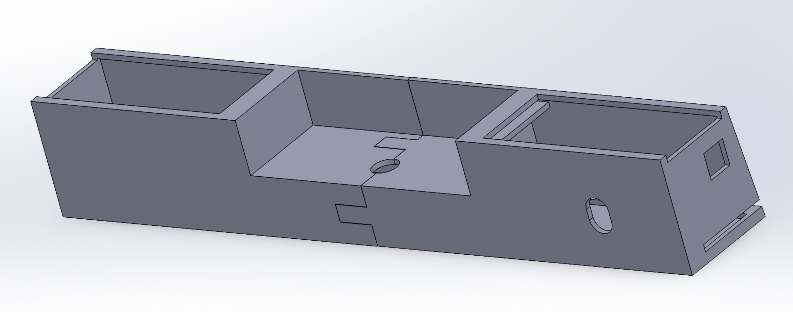
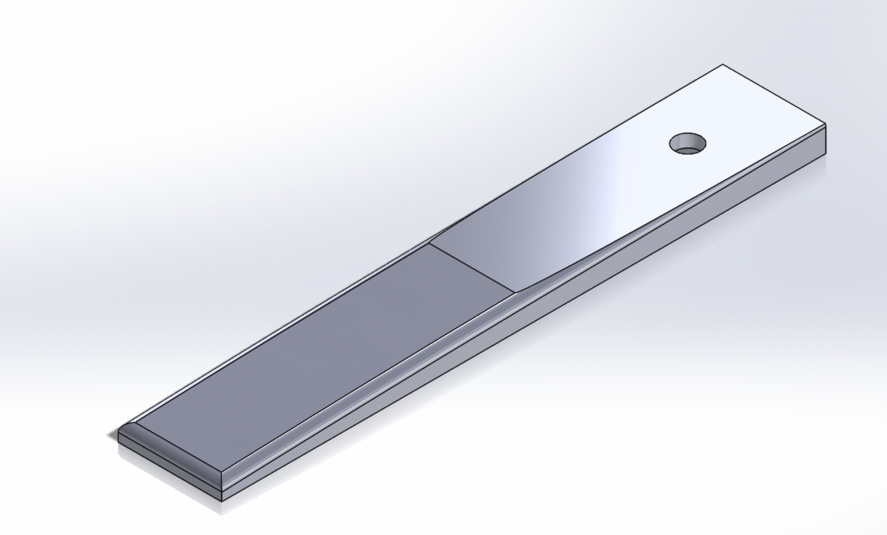

# Encore
Sound-Responsive auto page turner

An ESP32-based automatic page-turning device designed to help musicians turn sheet music hands-free during performance. The system detects audio and MIDI cues, filters ambient noise in real time, and actuates a custom mechanical mechanism to turn pages reliably.

> Built as a multidisciplinary engineering project integrating embedded programming, digital signal processing, mechanical design, rapid prototyping, and system testing.

## Project Overview

Turning sheet music manually can interrupt a musician’s performance, especially when both hands are occupied. Our team developed a compact automatic page turner that responds to musical cues and triggers a page-turning mechanism at the appropriate moment.

The final prototype achieved a **98% successful page-turn rate** during testing. To improve robustness in realistic performance environments, we implemented real-time signal processing that reduced ambient-noise interference by approximately **40%**.

## Video Demonstration

[](https://youtu.be/odfhlCd5ZI8)

## CAD Design

### Electronics Enclosure



### Arm



> **Fit note:** Music-stand rack angles vary by model, so the mounting slope may need to be adjusted to fit the target stand.

## Key Features

* Sound-responsive and MIDI-assisted page-turn triggering
* ESP32-based embedded control system
* Real-time moving-average filtering and frequency-feature extraction
* Custom mechanical page-turning mechanism
* 12 custom components designed and 3D printed in SolidWorks
* Motor-torque optimization and structural weight reduction of approximately 15%
* Tested page-turn success rate of 98%

## System Architecture

```text
Audio / MIDI Input
        ↓
Signal Processing on ESP32
        ↓
Trigger Decision Logic
        ↓
Servo Control
        ↓
Mechanical Page-Turning Mechanism
```

## My Contributions

As the team lead, I contributed across both the mechanical and embedded-system sides of the project:

* Led system-level integration between the sensing, control, and mechanical subsystems.
* Designed and iterated custom 3D-printed parts in SolidWorks for the page-turning mechanism.
* Implemented and tested real-time audio-processing methods, including moving-average filtering and frequency-feature extraction.
* Improved robustness against ambient noise, reducing interference by approximately 40%.
* Coordinated prototype testing and refinement to achieve a 98% successful page-turn rate.

## Hardware

* ESP32 microcontroller
* SG90 micro servo motor
* Analog microphone module
* Custom 3D-printed mechanical components
* Power supply / battery

## Software

* Arduino / ESP32 firmware
* Real-time moving-average filtering
* Frequency-based audio feature extraction
* PWM servo-control logic
* MIDI and/or audio-trigger detection

## Mechanical Design

The mechanism was designed to turn a single sheet reliably while avoiding page jams, double turns, and interference with the music stand. Multiple design iterations were tested to improve:

* Contact and friction between the mechanism and paper
* Servo torque requirements
* Alignment and repeatability
* Ease of assembly
* Device weight and portability

## Results

| Metric                                  | Result |
| --------------------------------------- | -----: |
| Page-turn success rate                  |    98% |
| Reduction in ambient-noise interference |   ~40% |
| Device weight reduction                 |   ~15% |

## Repository Structure

```text
.
├── firmware/        # ESP32 / Arduino source code
├── cad/             # SolidWorks parts and assemblies
├── electronics/     # Wiring diagrams and component information
├── images/          # Project photos, renders, and demo media
├── docs/            # Test results and design documentation
└── README.md
```

## Future Improvements

* Improve detection reliability across different instruments and venues
* Add a more adaptive audio-classification method
* Make the mechanism compatible with a wider range of sheet sizes and paper types
* Reduce assembly complexity for easier manufacturing
* Develop a cleaner enclosure and user interface for performance use

## License

This project was developed for academic purposes. Please contact the team before reusing the design or code.
